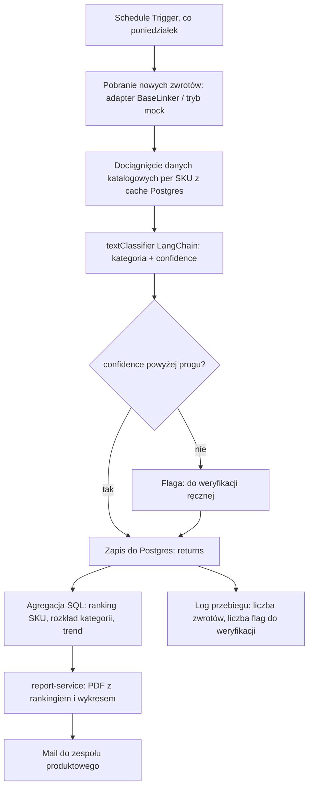

# Projekt 01: Analiza przyczyn zwrotów per SKU

Cotygodniowa analiza, które produkty generują najwięcej zwrotów i z jakiego powodu, na podstawie trzech źródeł danych naraz: wolnego tekstu od klienta, oceny stanu towaru z magazynu i danych katalogowych. Wyjście to ranking i rekomendacja działania, nie sam PDF.

Źródło w mapie procesów: obszar 06, "Zwroty i reklamacje", krok "Analiza przyczyn zwrotów per produkt".

## Dlaczego to jest realny problem, nie odtwarzanie gotowca

Sprawdziłem to przed projektowaniem, nie na słowo. W bibliotece szablonów n8n (1862 wyniki na hasła związane z klasyfikacją i raportowaniem AI, 1116 na "ai_automation") nie ma niczego, co łączy dane magazynowe, dane od obsługi klienta i katalog w jedną analizę per SKU. Powód jest prosty: żadna gotowa aplikacja SaaS nie ma jednoczesnego dostępu do wszystkich trzech źródeł u konkretnego sprzedawcy, bo te dane siedzą w jego własnych systemach, nie w systemie dostawcy aplikacji.

To odróżnia ten projekt od poprzedniej próby z PDF, gdzie cała wartość była gdzie indziej, w gotowych apkach za 20 dolarów miesięcznie.

## Dlaczego batch, nie webhook w czasie rzeczywistym

Świadoma zmiana kształtu względem ćwiczenia z PDF. Tam zdarzenie musiało być obsłużone natychmiast, bo klient czekał na maila. Tutaj decyzja biznesowa, czy poprawić opis produktu albo zgłosić reklamację do dostawcy, zapada raz w tygodniu, nie po każdym pojedynczym zwrocie. Uruchamianie analizy w czasie rzeczywistym byłoby przerostem formy: więcej ruchomych części, żadnej dodatkowej wartości. Harmonogram cotygodniowy to trafny dobór narzędzia do rytmu decyzji, nie uproszczenie na skróty.

## Taksonomia przyczyn zwrotu

Osiem kategorii, stałych, nie generowanych przez model za każdym razem, żeby wynik dało się agregować w czasie:

1. Niezgodność z opisem lub zdjęciem
2. Wada jakościowa, uszkodzenie fabryczne
3. Uszkodzenie w transporcie
4. Błędna wysyłka, nie ten produkt
5. Niedopasowanie, rozmiar, kolor, dopasowanie
6. Zmiana decyzji klienta
7. Opóźniona dostawa, zamówienie nieaktualne
8. Inne, nieokreślone

## Architektura



## Sprawdzenie skilli i gotowych bloków przed budową

Zgodnie z zasadą z CLAUDE.md sprawdziłem `npx skills find` (brak trafień, jak w poprzednim projekcie) oraz przeszukałem bibliotekę szablonów n8n przez `n8n-mcp`. Nic gotowego pod cały problem, ale znalazłem konkretny, sprawdzony węzeł do ponownego użycia: `@n8n/n8n-nodes-langchain.textClassifier`, wbudowany węzeł LangChain w n8n zrobiony dokładnie do klasyfikacji tekstu na zamknięty zestaw kategorii, z wymuszonym schematem wyjścia. Używam go zamiast pisać własne query do modelu i parsować odpowiedź ręcznie.

Reużywam też architektury z `cwiczenie-docker-n8n-pdf`: adapter na wejściu, bezstanowy mikroserwis do renderowania dokumentu przez Jinja2 i WeasyPrint, Postgres jako jedyne źródło prawdy. To nie przypadek, tylko świadome powtórzenie wzorca, który już raz zadziałał, zamiast wymyślania nowego za każdym razem.

## Model danych

### ReturnEvent, schemat wewnętrzny

```json
{
  "source": "baselinker",
  "external_return_id": "RMA-2026-00931",
  "sku": "ABC-123",
  "order_id": "PL-10234",
  "reason_text": "Sukienka w innym kolorze niż na zdjęciu, materiał też inny",
  "condition_note": "towar bez śladów użytkowania, oryginalne metki",
  "returned_at": "2026-09-08T09:12:00Z"
}
```

`reason_text` to wolny tekst od klienta, `condition_note` to ocena magazynu przy przyjęciu zwrotu. Oba trafiają razem do klasyfikatora, bo czasem się uzupełniają, a czasem zaprzeczają sobie (klient pisze "wada", magazyn widzi ślady zwykłego noszenia), i to rozbieżność wartą oznaczenia, nie tylko pojedynczy sygnał.

### Schemat Postgres

```sql
CREATE TABLE sku_catalog_cache (
    sku TEXT PRIMARY KEY,
    name TEXT NOT NULL,
    category TEXT,
    unit_price NUMERIC(10,2),
    supplier TEXT,
    updated_at TIMESTAMPTZ NOT NULL DEFAULT now()
);

CREATE TABLE returns (
    id BIGSERIAL PRIMARY KEY,
    external_return_id TEXT UNIQUE NOT NULL,
    sku TEXT NOT NULL REFERENCES sku_catalog_cache(sku),
    reason_category TEXT NOT NULL,
    confidence NUMERIC(4,3) NOT NULL,
    needs_review BOOLEAN NOT NULL DEFAULT false,
    reason_text TEXT NOT NULL,
    condition_note TEXT,
    returned_at TIMESTAMPTZ NOT NULL,
    created_at TIMESTAMPTZ NOT NULL DEFAULT now()
);

CREATE TABLE classification_runs (
    id BIGSERIAL PRIMARY KEY,
    run_at TIMESTAMPTZ NOT NULL DEFAULT now(),
    returns_processed INT NOT NULL,
    flagged_for_review INT NOT NULL
);
```

`UNIQUE` na `external_return_id`, ten sam wzorzec idempotencji co w poprzednim projekcie, ważny również przy analizie wsadowej, bo ponowne uruchomienie po błędzie nie może policzyć tego samego zwrotu dwa razy.

## Stack technologiczny

### n8n

1. Schedule Trigger, co poniedziałek 6:00
2. HTTP Request: adapter BaseLinker (albo odczyt pliku mock w trybie demo, patrz sekcja "Tryb demo")
3. Postgres: upsert do `sku_catalog_cache`, dociągnięcie brakujących SKU
4. `@n8n/n8n-nodes-langchain.textClassifier`: model Claude Haiku (tanio, szybko, wystarczające do klasyfikacji krótkiego tekstu), osiem kategorii z zamkniętej listy, zwraca kategorię i confidence
5. IF: confidence poniżej 0.6 -> `needs_review = true`
6. Postgres: insert do `returns`
7. Postgres: zapytanie agregujące, ranking SKU po liczbie zwrotów i po udziale procentowym w sprzedaży danego SKU
8. HTTP Request do `report-service`
9. Send Email z załącznikiem PDF
10. Postgres: insert do `classification_runs`

### report-service (Python 3.12, FastAPI)

Ten sam szkielet co w ćwiczeniu PDF, inny szablon i dodatkowo generowanie wykresu.

| Biblioteka | Rola |
|---|---|
| `fastapi`, `uvicorn[standard]` | serwer |
| `pydantic` v2 | walidacja danych wejściowych raportu |
| `jinja2` | szablon HTML |
| `weasyprint` | render do PDF |
| brak matplotlib, celowo | wykres słupkowy jako czyste SVG generowane w Pythonie (`f-string` albo mały helper), żeby nie dociągać kolejnej ciężkiej zależności systemowej do obrazu Dockera |

### Postgres 16, ten sam kontener co w ćwiczeniu PDF, osobna baza danych w ramach tej samej instancji (`returns_analysis`), zamiast osobnego kontenera.

### Tryb demo, bez żywego BaseLinkera

Projekt musi dać się pokazać w portfolio, zanim ktokolwiek podłączy prawdziwy sklep. `data/mock/returns_sample.json` z 30 do 50 przykładowymi zwrotami po polsku, w tym celowo kilka niejednoznacznych (na przykład sprzeczne sygnały klient/magazyn), plus `data/mock/catalog_sample.json`. Zmienna środowiskowa `SOURCE_MODE=mock|baselinker` przełącza adapter na wejściu workflowu. To dokładnie ten sam wzorzec adaptera, co "Shopify kontra inne platformy" w projekcie WISMO, konsekwentnie powtórzony.

### VS Code

Te same rozszerzenia co w poprzednim projekcie (Python, Pylance, Ruff, Docker, YAML, Jinja, dotenv, GitLens), bez zmian, bo stack się powtarza.

## Jakość klasyfikacji, nie tylko czy kod działa

To jest różnica względem ćwiczenia z PDF, gdzie testy sprawdzały poprawność liczb. Tutaj trzeba też zmierzyć, czy klasyfikator ma rację.

`eval/dataset.jsonl`: 30 ręcznie oznaczonych przykładów tekstów zwrotu po polsku, z poprawną kategorią przypisaną przeze mnie jako dane odniesienia, w tym kilka trudnych przypadków celowo (sarkazm, sprzeczne sygnały, bardzo krótki tekst typu "nie pasuje").

`eval/run_eval.py`: mały skrypt, przepuszcza wszystkie 30 przez ten sam prompt klasyfikacyjny co węzeł n8n (ten sam prompt trzymany w jednym miejscu, `n8n-workflows/classifier_prompt.md`, żeby nie rozjechały się dwie kopie), liczy trafność i macierz pomyłek, zapisuje wynik do `eval/results.md`.

Cel jakości: powyżej 85 procent trafności na zbiorze ewaluacyjnym, poniżej tego progu prompt wraca do poprawy, nie idzie od razu na produkcję.

## Testy

1. Bruno: `report-service` z przykładowymi danymi rankingu, sprawdzenie że PDF się generuje i ma poprawną liczbę stron.
2. Pytest: agregacja SQL (na testowej bazie), generowanie SVG wykresu, walidacja modelu Pydantic.
3. Eval: opisany wyżej, osobna kategoria testów, bo mierzy jakość modelu, nie poprawność kodu.

## Struktura repo

```
01-analiza-zwrotow-per-sku/
├── CLAUDE.md
├── README.md
├── DESIGN.md
├── docker-compose.yml
├── .env.example
├── n8n-workflows/
│   ├── weekly-returns-analysis.json
│   └── classifier_prompt.md          prompt trzymany osobno, współdzielony z eval
├── report-service/
│   ├── app/
│   │   ├── main.py
│   │   ├── models.py
│   │   ├── chart.py                  generator wykresu SVG
│   │   └── templates/
│   │       ├── returns_report.html
│   │       └── style.css
│   ├── tests/
│   ├── requirements.txt
│   └── Dockerfile
├── db/
│   └── init.sql
├── data/mock/
│   ├── returns_sample.json
│   └── catalog_sample.json
├── eval/
│   ├── dataset.jsonl
│   ├── run_eval.py
│   └── results.md
├── bruno-collection/
└── .vscode/
    └── extensions.json
```

## Plan budowy, krok po kroku

1. `db/init.sql`, uruchomienie Postgresa, ręczna weryfikacja.
2. Dane mock: 30 do 50 przykładów zwrotów, w tym trudne przypadki.
3. `eval/dataset.jsonl` i `classifier_prompt.md`, zanim jeszcze cokolwiek jest w n8n, żeby prompt był przetestowany osobno.
4. `eval/run_eval.py`, iteracja nad promptem do progu 85 procent trafności.
5. `report-service`: model, generator wykresu SVG, szablon, endpoint, testy, Dockerfile.
6. Workflow n8n przez `n8n-mcp`: adapter, klasyfikator z gotowym już promptem, Postgres, agregacja.
7. Pięcie raportu i maila.
8. Pełny przebieg end to end na danych mock, Bruno.
9. README z opisem, przykładowym wygenerowanym raportem, wynikiem eval, i notatką jak podłączyć prawdziwego BaseLinkera zamiast trybu mock.

## Definicja gotowości

Eval powyżej 85 procent trafności. Pełny przebieg na danych mock generuje poprawny PDF z rankingiem. Powtórne uruchomienie na tych samych danych nie duplikuje wpisów w Postgres. README pozwala komuś innemu uruchomić projekt jednym poleceniem i zobaczyć wynik bez podłączania własnego sklepu.
