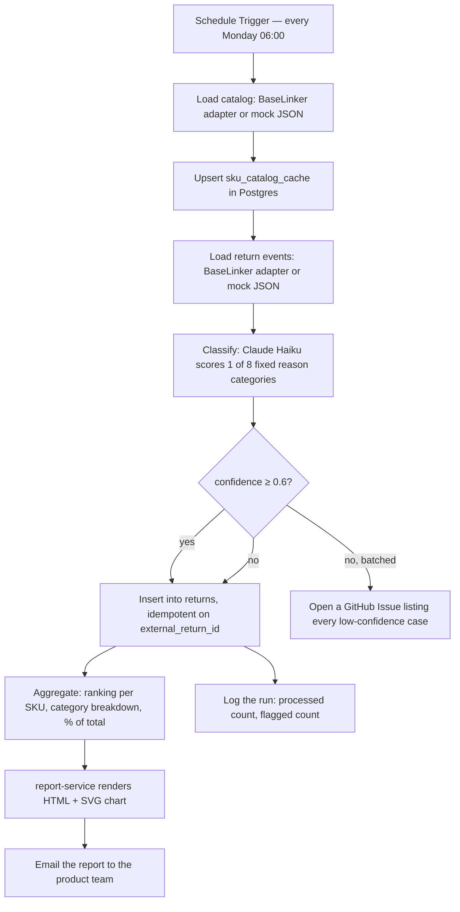

*[Czytaj po polsku](./README.pl.md)*

# Returns Analysis per SKU

A weekly automation that tells you which products are getting returned and why — before it becomes a pattern you find out about the hard way.

It pulls return events from three sources that normally never talk to each other (the customer's free-text reason, the warehouse's physical inspection note, and the product catalog), classifies each return into one of eight fixed categories with an LLM, and turns a week of noisy text into a ranked PDF report your product team can act on in five minutes.

Built as a portfolio piece to demonstrate a specific pattern: **cross-source correlation that no off-the-shelf SaaS can do**, because the three data sources live in different systems owned by the merchant, not by a returns-analytics vendor.

## Why this exists

I checked the n8n template library before building this — 1,862 results for classification/reporting workflows, none of them joining warehouse condition notes with customer-facing return reasons and a product catalog into one per-SKU view. That's not a coincidence: a SaaS tool would need write access to your WMS, your storefront, and your support inbox simultaneously. A workflow running inside your own infrastructure doesn't have that problem.

## What it actually does



Eight reason categories, fixed rather than freely generated by the model, so results stay comparable week over week:

1. Mismatch with description or photo
2. Quality defect / factory fault
3. Damaged in transit
4. Wrong item shipped
5. Doesn't fit — size, color, comfort
6. Customer changed their mind
7. Late delivery, order no longer relevant
8. Other / unclear

When the customer's account and the warehouse's inspection note disagree — customer says "defective," warehouse sees ordinary wear — the classifier is instructed to prefer whichever category both sources actually support, and to lower its confidence rather than guess. Low-confidence cases don't get silently buried: they're batched into a single GitHub Issue for someone to look at, instead of one email per edge case.

## Classifier evaluation

The prompt was evaluated against a hand-labeled set before it ever touched a workflow node — including a few genuinely ambiguous cases (sarcasm, contradicting signals, "doesn't fit" with zero context) — because a classification pipeline is only as trustworthy as its worst-case accuracy, not its demo-case accuracy.

| Metric | Result |
|---|---|
| Model | Claude Haiku 4.5 |
| Eval set | 30 hand-labeled examples |
| Accuracy | **90% (27/30)** |
| Threshold to ship | 85% |
| Misclassifications | 3, all on the *fit vs. changed-mind* boundary |

Full confusion matrix and per-case breakdown: [`eval/results.md`](./eval/results.md). Re-run it yourself:

```bash
export ANTHROPIC_API_KEY="sk-..."
python eval/run_eval.py
```

## An honest note on the n8n classifier node

The design originally called for n8n's built-in `@n8n/n8n-nodes-langchain.textClassifier` node — it's purpose-built for exactly this. In practice it routes each item to one of *N* separate output branches instead of emitting a `confidence` field on the JSON payload, which makes the confidence-threshold / `needs_review` logic this project depends on impossible to wire up with that node alone.

The workflow instead calls the Anthropic Messages API directly via an HTTP Request node, using the identical prompt that produced the 90% eval result above, and parses `{category, confidence}` out of the response in a small Code node (with defensive normalization, since the model occasionally echoes a category's full description instead of just its name). Same accuracy, and the confidence-based review flag still works. If you're building something similar, this is worth knowing before you commit to `textClassifier` for a use case that needs per-item confidence.

## Stack

- **n8n** — orchestration (17-node workflow, importable JSON in [`n8n-workflows/`](./n8n-workflows/))
- **Claude Haiku 4.5** (Anthropic API) — reason classification
- **PostgreSQL 16** — source of truth (`returns`, `sku_catalog_cache`, `classification_runs`)
- **FastAPI + Jinja2** — report-service, renders the HTML/PDF report with a hand-rolled SVG bar chart (no matplotlib — one less system dependency in the image)
- **Docker Compose** — the whole stack, one command

## Quick start

```bash
git clone https://github.com/HubskiIT/returns-analysis-per-sku.git
cd returns-analysis-per-sku
export ANTHROPIC_API_KEY="sk-..."
docker compose up -d
```

Then open n8n at `http://localhost:5678`, import [`n8n-workflows/weekly-returns-analysis.json`](./n8n-workflows/weekly-returns-analysis.json), wire up your Anthropic and Postgres credentials, and run it. It ships with 36 mock return events and 18 mock catalog SKUs, so the whole pipeline is demoable with zero external store connected.

## Data model

```sql
CREATE TABLE returns (
    id BIGSERIAL PRIMARY KEY,
    external_return_id TEXT UNIQUE NOT NULL,   -- re-running the workflow never double-counts
    sku TEXT NOT NULL REFERENCES sku_catalog_cache(sku),
    reason_category TEXT NOT NULL,             -- one of the 8 fixed categories
    confidence NUMERIC(4,3) NOT NULL,
    needs_review BOOLEAN NOT NULL DEFAULT false,
    reason_text TEXT NOT NULL,                 -- customer's own words
    condition_note TEXT,                       -- warehouse's inspection note
    returned_at TIMESTAMPTZ NOT NULL,
    created_at TIMESTAMPTZ NOT NULL DEFAULT now()
);

CREATE TABLE sku_catalog_cache (
    sku TEXT PRIMARY KEY,
    name TEXT NOT NULL,
    category TEXT,
    unit_price NUMERIC(10,2),
    supplier TEXT,
    updated_at TIMESTAMPTZ NOT NULL DEFAULT now()
);

CREATE TABLE classification_runs (
    id BIGSERIAL PRIMARY KEY,
    run_at TIMESTAMPTZ NOT NULL DEFAULT now(),
    returns_processed INT NOT NULL,
    flagged_for_review INT NOT NULL
);
```

## Repository layout

```
├── DESIGN.md                         full architecture spec and the decisions behind it
├── docker-compose.yml                n8n + postgres + report-service
├── db/init.sql                       schema above, applied on first boot
├── data/mock/                        36 return events, 18 catalog SKUs — demo mode, zero live store needed
├── n8n-workflows/
│   ├── weekly-returns-analysis.json  the workflow, ready to import
│   └── classifier_prompt.md          the exact prompt used by both the workflow and the eval script
├── eval/
│   ├── dataset.jsonl                 30 hand-labeled examples
│   ├── run_eval.py                   accuracy + confusion matrix, run before touching n8n
│   └── results.md                    latest eval run
└── report-service/                   FastAPI app: Pydantic models, SVG chart, Jinja2 template, pytest suite
```

## Testing

```bash
# report-service unit tests (models, chart generation, validation)
cd report-service && python -m pytest tests/ -v

# classifier eval (accuracy against the hand-labeled set)
python eval/run_eval.py

# end-to-end: run the workflow in n8n, then check Postgres
docker compose exec postgres psql -U postgres -d returns_analysis -c "SELECT * FROM returns;"
```

Re-running the workflow against the same mock data doesn't duplicate rows — that's what the `UNIQUE` constraint on `external_return_id` is for, and it's been verified by actually re-running it, not just asserted in a doc.

## Going to production

1. Swap the mock-JSON read nodes for a real BaseLinker adapter (or whatever your order/returns system exposes).
2. Point the schedule trigger at your actual reporting cadence — weekly, Monday 06:00 is the default, not a requirement.
3. Wire a real SendGrid (or SMTP) credential into the email node.
4. Watch `flagged_for_review` as a % of total — if it's consistently above ~20%, the prompt needs another eval pass before you trust it unattended.

## License

MIT — Hubert Grzybowski ([grzybowski.it@gmail.com](mailto:grzybowski.it@gmail.com))
