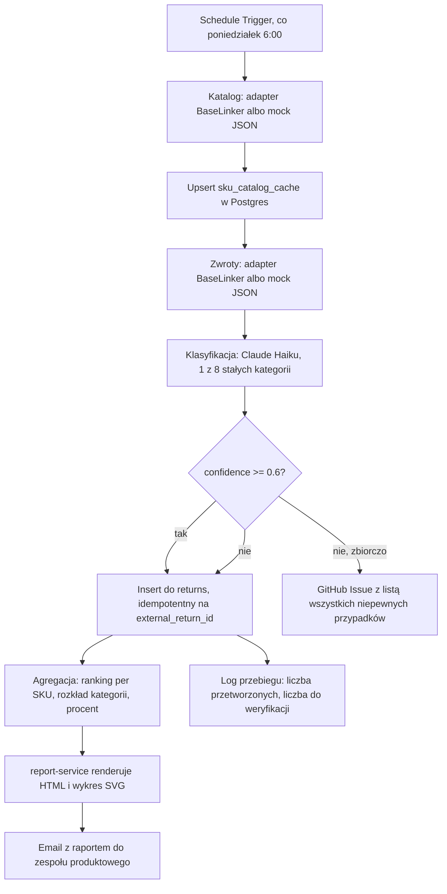

*[Read in English](./README.md)*

# Analiza przyczyn zwrotów per SKU

Cotygodniowa automatyzacja, która pokazuje, które produkty generują najwięcej zwrotów i dlaczego, zanim to się zamieni w problem odkryty przypadkiem.

Łączy dane zwrotów z trzech źródeł, które normalnie ze sobą nie rozmawiają: wolny tekst od klienta, notatka magazynu ze stanu towaru przy przyjęciu, katalog produktowy. Klasyfikuje każdy zwrot do jednej z ośmiu stałych kategorii przez LLM i zamienia tydzień chaotycznego tekstu w ranking, który zespół produktowy ogarnia w pięć minut.

Projekt portfolio pokazujący konkretny wzorzec: **korelację między źródłami danych, której żadne gotowe SaaS nie zrobi**, bo te trzy źródła siedzą w osobnych systemach należących do sprzedawcy, nie do dostawcy narzędzia analitycznego.

## Dlaczego to ma sens

Sprawdziłem bibliotekę szablonów n8n przed budową. 1862 wyniki dla klasyfikacji i raportowania, żaden nie łączy notatek magazynowych, tekstu od klienta i katalogu w jeden widok per SKU. To nie przypadek. SaaS musiałby mieć jednoczesny dostęp zapisu do WMS, sklepu i skrzynki supportu. Workflow działający w twojej własnej infrastrukturze tego problemu nie ma.

## Co dokładnie się dzieje



Osiem kategorii, stałych, nie generowanych swobodnie przez model, żeby wyniki dało się porównywać tydzień do tygodnia:

1. Niezgodność z opisem lub zdjęciem
2. Wada jakościowa, uszkodzenie fabryczne
3. Uszkodzenie w transporcie
4. Błędna wysyłka, nie ten produkt
5. Niedopasowanie, rozmiar, kolor, dopasowanie
6. Zmiana decyzji klienta
7. Opóźniona dostawa, zamówienie nieaktualne
8. Inne, nieokreślone

Kiedy opis klienta i notatka magazynu się rozjeżdżają, na przykład klient pisze "wada", a magazyn widzi zwykłe ślady noszenia, klasyfikator ma wybrać kategorię lepiej wspartą przez oba źródła i obniżyć confidence zamiast zgadywać. Niepewne przypadki nie giną po cichu. Trafiają zbiorczo do jednego GitHub Issue, jeden na przebieg, nie jeden na przypadek, żeby ktoś je przejrzał bez zalewu maili. [Tu przykład z realnego przebiegu testowego](https://github.com/HubskiIT/returns-analysis-per-sku/issues/2), z najlepszym przypuszczeniem klasyfikatora i oboma surowymi sygnałami, żeby recenzent nie musiał grzebać w danych źródłowych.

## Ewaluacja klasyfikatora

Prompt był testowany na ręcznie oznaczonym zbiorze zanim trafił do jakiegokolwiek węzła workflow, w tym kilka naprawdę niejednoznacznych przypadków: sarkazm, sprzeczne sygnały, "nie pasuje" bez żadnego kontekstu. Jakość pipeline'u klasyfikacji mierzy się najgorszym przypadkiem, nie przypadkiem demo.

| Metryka | Wynik |
|---|---|
| Model | Claude Haiku 4.5 |
| Zbiór eval | 30 ręcznie oznaczonych przykładów |
| Trafność | **90% (27/30)** |
| Próg wdrożenia | 85% |
| Błędy | 3, wszystkie na granicy dopasowanie kontra zmiana decyzji |

Pełna macierz pomyłek jest w [`eval/results.md`](./eval/results.md). Uruchom sam:

```bash
export ANTHROPIC_API_KEY="sk-..."
python eval/run_eval.py
```

## Szczera uwaga o węźle klasyfikatora n8n

Projekt pierwotnie zakładał wbudowany węzeł n8n `@n8n/n8n-nodes-langchain.textClassifier`, zrobiony dokładnie do tego celu. W praktyce routinguje każdy item na jedno z N osobnych wyjść zamiast zwracać pole `confidence` w JSON, co uniemożliwia zbudowanie logiki progu confidence i `needs_review`, na której ten projekt się opiera.

Workflow zamiast tego wywołuje Anthropic Messages API bezpośrednio przez węzeł HTTP Request, z dokładnie tym samym promptem, który dał 90% w eval, i parsuje `{category, confidence}` z odpowiedzi w małym węźle Code, z defensywną normalizacją, bo model czasem odbija pełny opis kategorii zamiast samej nazwy. Ta sama trafność, a mechanizm progu confidence dalej działa. Jeśli budujesz coś podobnego, warto to wiedzieć, zanim postawisz na `textClassifier` w przypadku wymagającym confidence per item.

## Stack

- **n8n**: orkiestracja, workflow z 20 węzłów, JSON gotowy do importu w [`n8n-workflows/`](./n8n-workflows/)
- **Claude Haiku 4.5** (Anthropic API): klasyfikacja przyczyn
- **PostgreSQL 16**: źródło prawdy (`returns`, `sku_catalog_cache`, `classification_runs`)
- **FastAPI plus Jinja2**: report-service, renderuje raport HTML/PDF z ręcznie napisanym wykresem SVG, bez matplotlib, o jedną zależność systemową mniej w obrazie
- **GitHub API**: niepewne przypadki trafiają do jednego, oznaczonego etykietą Issue zamiast ginąć w skrzynce
- **Docker Compose**: cały stack, jedna komenda

## Szybki start

```bash
git clone https://github.com/HubskiIT/returns-analysis-per-sku.git
cd returns-analysis-per-sku
export ANTHROPIC_API_KEY="sk-..."
docker compose up -d
```

Otwórz n8n na `http://localhost:5678`, zaimportuj [`n8n-workflows/weekly-returns-analysis.json`](./n8n-workflows/weekly-returns-analysis.json), podepnij swoje credentials Anthropic i Postgres, uruchom. Projekt ma wbudowane 36 mockowych zwrotów i 18 mockowych SKU, więc cały pipeline daje się pokazać bez podłączania prawdziwego sklepu.

## Model danych

```sql
CREATE TABLE returns (
    id BIGSERIAL PRIMARY KEY,
    external_return_id TEXT UNIQUE NOT NULL,   -- powtórne uruchomienie nigdy nie liczy podwójnie
    sku TEXT NOT NULL REFERENCES sku_catalog_cache(sku),
    reason_category TEXT NOT NULL,             -- jedna z 8 stałych kategorii
    confidence NUMERIC(4,3) NOT NULL,
    needs_review BOOLEAN NOT NULL DEFAULT false,
    reason_text TEXT NOT NULL,                 -- słowa klienta
    condition_note TEXT,                       -- notatka magazynu
    returned_at TIMESTAMPTZ NOT NULL,
    created_at TIMESTAMPTZ NOT NULL DEFAULT now()
);

CREATE TABLE sku_catalog_cache (
    sku TEXT PRIMARY KEY,
    name TEXT NOT NULL,
    category TEXT,
    unit_price NUMERIC(10,2),
    supplier TEXT,
    updated_at TIMESTAMPTZ NOT NULL DEFAULT now()
);

CREATE TABLE classification_runs (
    id BIGSERIAL PRIMARY KEY,
    run_at TIMESTAMPTZ NOT NULL DEFAULT now(),
    returns_processed INT NOT NULL,
    flagged_for_review INT NOT NULL
);
```

## Struktura repo

```
├── DESIGN.md                         pełna specyfikacja architektury i decyzje za nią stojące
├── docker-compose.yml                n8n + postgres + report-service
├── db/init.sql                       schemat powyżej, aplikowany przy pierwszym uruchomieniu
├── data/mock/                        36 zwrotów, 18 SKU katalogu, tryb demo bez żywego sklepu
├── n8n-workflows/
│   ├── weekly-returns-analysis.json  workflow, gotowy do importu
│   └── classifier_prompt.md          dokładny prompt używany przez workflow i skrypt eval
├── eval/
│   ├── dataset.jsonl                 30 ręcznie oznaczonych przykładów
│   ├── run_eval.py                   trafność i macierz pomyłek, uruchom przed dotknięciem n8n
│   └── results.md                    ostatni wynik eval
└── report-service/                   aplikacja FastAPI: modele Pydantic, wykres SVG, szablon Jinja2, testy pytest
```

## Testowanie

```bash
# testy jednostkowe report-service (modele, generowanie wykresu, walidacja)
cd report-service && python -m pytest tests/ -v

# eval klasyfikatora (trafność na ręcznie oznaczonym zbiorze)
python eval/run_eval.py

# end to end: uruchom workflow w n8n, sprawdź Postgres
docker compose exec postgres psql -U postgres -d returns_analysis -c "SELECT * FROM returns;"
```

Powtórne uruchomienie workflow na tych samych danych mock nie duplikuje wierszy. Od tego jest ograniczenie `UNIQUE` na `external_return_id`, zweryfikowane przez faktyczne powtórne uruchomienie, nie tylko zapisane w dokumencie.

## Droga do produkcji

1. Zamień węzły czytające mock JSON na prawdziwy adapter BaseLinker, albo cokolwiek twój system zamówień i zwrotów udostępnia.
2. Ustaw schedule trigger na swój rzeczywisty rytm raportowania. Co tydzień, poniedziałek 6:00 to wartość domyślna, nie wymóg.
3. Podepnij prawdziwy credential SendGrid, albo SMTP, do węzła email. Jest w pełni skonfigurowany i gotowy, tylko domyślnie wyłączony, żeby workflow nie wywalał się na brakującym kluczu od razu po sklonowaniu.
4. Skieruj węzeł GitHub Issue na własne repo, albo zamień na Slack, Linear, cokolwiek twój zespół faktycznie obserwuje.
5. Obserwuj `flagged_for_review` jako procent całości. Jeśli konsekwentnie przekracza około 20 procent, prompt potrzebuje kolejnej rundy eval, zanim zaufasz mu bez nadzoru.

**Uwaga o fine-grained tokenach GitHub**, bo kosztowała realny czas debugowania. Przyznanie tokenowi dostępu do repo to nie to samo co przyznanie dostępu do Issues. To osobne checkboxy w sekcji "Repository permissions", a 403 od GitHuba przy braku tego drugiego nie mówi, którego uprawnienia brakuje, chyba że przeczytasz nagłówek odpowiedzi `x-accepted-github-permissions`. Zmiana uprawnień nie działa też, dopóki nie klikniesz "Regenerate token", nawet jeśli zmieniłeś tylko same uprawnienia. Jeśli węzeł GitHub zwraca "Resource not accessible by personal access token", to najpewniej właśnie to.

## Licencja

MIT. Hubert Grzybowski ([grzybowski.it@gmail.com](mailto:grzybowski.it@gmail.com))
